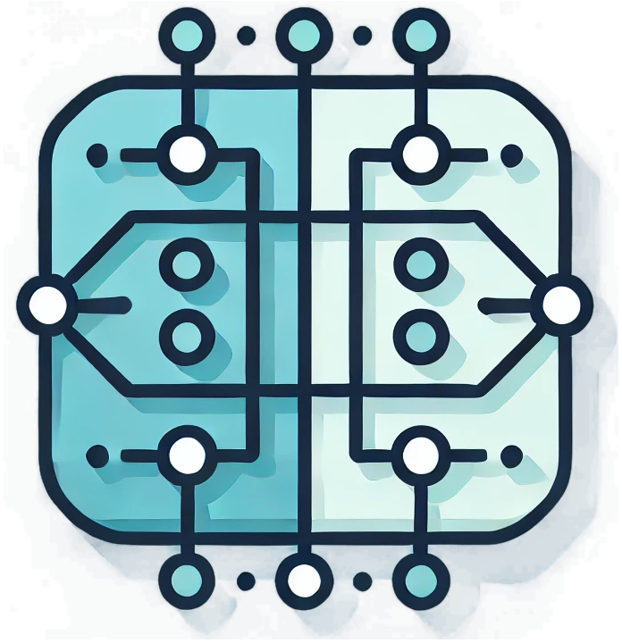

#  StreaHMM

A framework for combining hidden Markov models (HMMs) and modern deep learning.

Targeted features:

- Implements algorithms for gradient-based HMM training and inference.
- Modular emission distributions (discrete, continuous).
- Supports multiple, parallel HMMs with variable architectures.
- Implements parallel variants of all algorithms to support ultra-long sequences.
- Can be used with multiple machine learning frameworks: PyTorch and TensorFlow.

